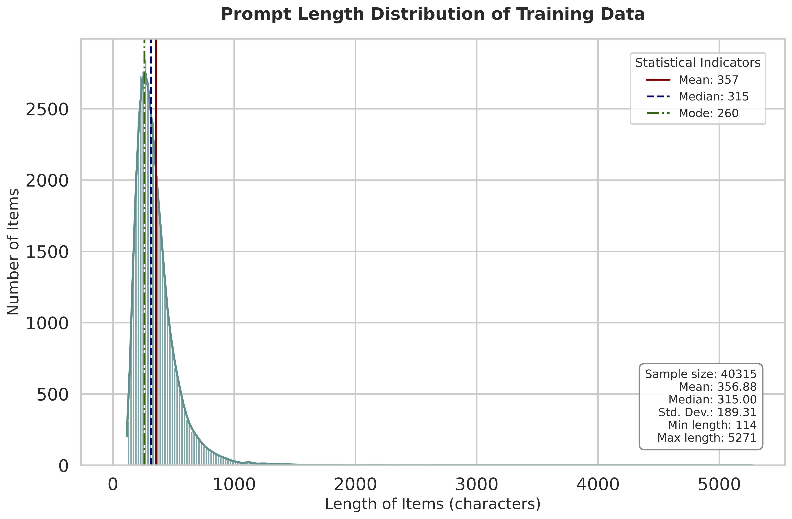
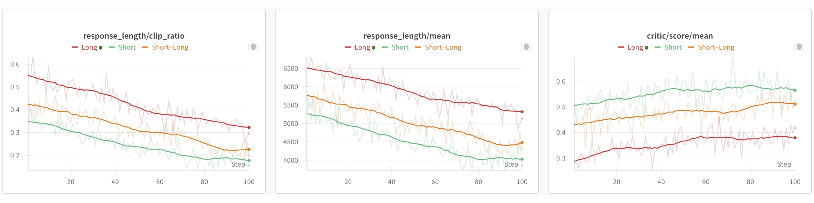
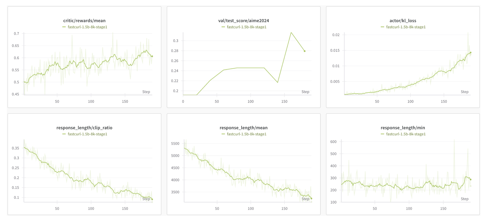
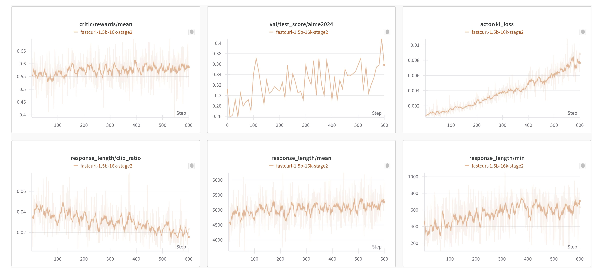
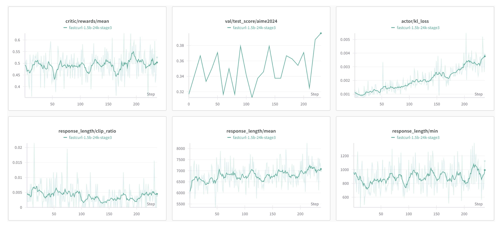
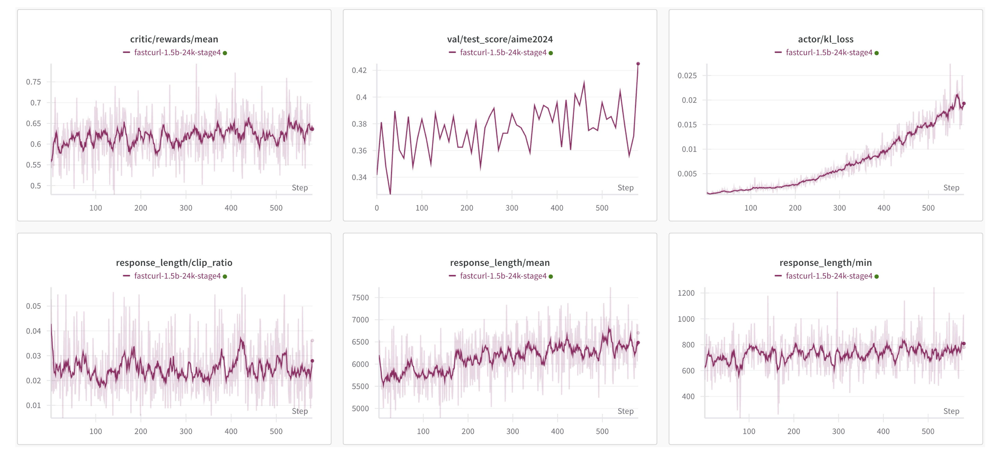

<h2>FastCuRL: Improving RL Training Efficiency of R1-like Reasoning Models via Curriculum-Guided Iterative Lengthening</h2>

<!-- TODO:  Thread, Paper, Dataset, Weights-->

We release **FastCuRL-1.5B-Preview**, a slow-thinking reasoning model that achieves 43.1% accuracy on the AIME 2024 benchmark! We adapt a novel curriculum-guided iterative lengthening reinforcement learning to the distilled 1.5B model and observe continuous performance improvement as training steps increase. To better reproduce our work and advance research progress, we open-source our code, model, and data.

### Key Results

Training Details. 

| Model | Training Steps  | Training Stages | Number of GPUs Used in Each Stage |
|-------|-----------|-----------|-----------|
| DeepScaleR-1.5B-Preview | ~1,750 | 3 | 8, 16, 32 |
| **FastCuRL-1.5B-Preview** | ~860 | 4 | 8, 8, 8, 8 |

Here, we uniformly set the batch size to 128 for counting training steps, meaning two steps with batch size 64 are counted as one with batch size 128.

We report Pass@1 accuracy averaged over 16 samples for each problem.

| Model | AIME 2024 | MATH 500 | AMC 2023 | Minerva Math | OlympiadBench | Avg. |
|-------|-----------|-----------|-----------|--------------|---------------|------|
| Qwen2.5-Math-7B-Instruct | 13.3 | 79.8 | 50.6 | 34.6 | 40.7 | 43.8 |
| rStar-Math-7B | 26.7 | 78.4 | 47.5 | - | 47.1 | - |
| Eurus-2-7B-PRIME | 26.7 | 79.2 | 57.8 | 38.6 | 42.1 | 48.9 |
| Qwen2.5-7B-SimpleRL | 26.7 | 82.4 | 62.5 | <strong>39.7</strong> | 43.3 | 50.9 |
| DeepSeek-R1-Distill-Qwen-1.5B | 28.8 | 82.8 | 62.9 | 26.5 | 43.3 | 48.9 |
| Still-1.5B | 32.5 | 84.4 | 66.7 | 29.0 | 45.4 | 51.6 |
| DeepScaleR-1.5B-Preview | 43.1 | 87.8 | 73.6 | 30.2 | 50.0 | 57.0 |
| <strong>FastCuRL-1.5B-Preview</strong> | <strong>43.1</strong> | <strong>88.0</strong> | <strong>74.2</strong> | 31.6 | <strong>50.4</strong> | <strong>57.5</strong> |

### Training Data
Following DeepScaleR, our training dataset consists of 40,315 unique problem-answer pairs compiled from:
- AIME problems (1984-2023)
- AMC problems (before 2023)
- Omni-MATH dataset
- Still dataset

In FastCuRL, we propose a simple condition-sensitive data segmentation approach, which splits the original dataset into three subsets.

[Segmented Datasets](https://huggingface.co/datasets/Nickyang/FastCuRL)

### Training Strategy
In FastCuRL, we propose a curriculum-guided iterative lengthening approach for improving the RL training efficiency of R1-like reasoning models. Specifically, the four stages are as follows:
- Stage I (8K context,∼160 steps)

- Stage II (16K context,∼295 steps)

- Stage III (24K context,∼115 steps)

- Stage IV (24K context,∼290 steps)

Overall, we find that during the whole training process, the steps chosen for stage transitions mainly occurred toward the end of each stage, further highlighting the efficiency of the proposed FastCuRL approach.

### Acknowledgements

- Our training experiments are powered by our heavily modified fork of [verl](https://github.com/volcengine/verl) and [deepscaler](https://github.com/agentica-project/deepscaler).
- Our model is trained on top of [`DeepSeek-R1-Distill-Qwen-1.5B`](https://huggingface.co/deepseek-ai/DeepSeek-R1-Distill-Qwen-1.5B).
